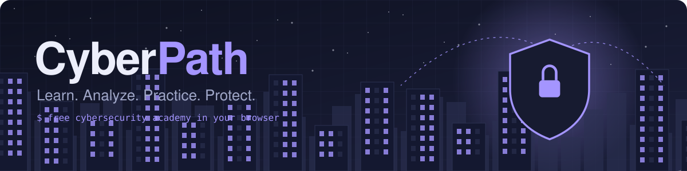
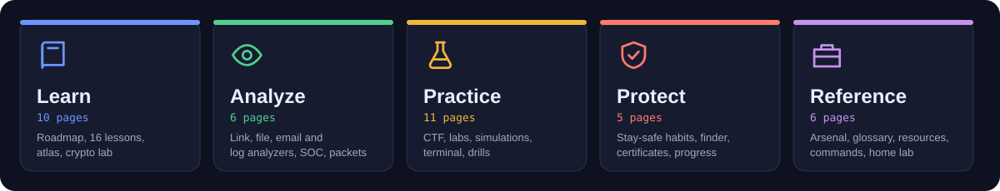
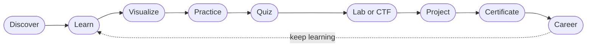
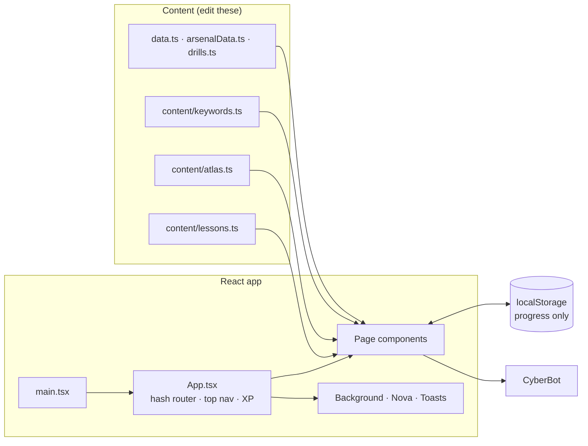

<p align="center">
  
</p>

<p align="center">
  
  
  
  
  
  
  
  
</p>

<p align="center">
  <a href="#-quick-start">Quick start</a> ·
  <a href="#-whats-inside">What's inside</a> ·
  <a href="#-how-it-fits-together">Architecture</a> ·
  <a href="#-customize-it">Customize</a> ·
  <a href="#-troubleshooting">Troubleshooting</a>
</p>

<p align="center">
  
</p>

> ⚠️ **Educational use only.** Practice only on systems you own or have written permission to test. Unauthorized access is illegal.

---

## ✨ At a glance

| 📘 Guided lessons | 🧠 Advanced concepts | 🧰 Tools and techniques | 📖 Glossary terms | 🎓 Certificates with links |
|:---:|:---:|:---:|:---:|:---:|
| **16** | **59** | **72** | **121** | **15** |

| 🚩 CTF challenges | 🧪 Lab challenges | 🎬 Attack simulations | 🗺️ Lesson diagrams | 🏅 Achievements |
|:---:|:---:|:---:|:---:|:---:|
| **11** | **12** | **10** | **13** | **14** |

```text
$ cyberpath status
CyberPath lab status (simulated)
SYSTEM ........ ONLINE
NETWORK ....... SEGMENTED
THREATS ....... 03
ALERTS ........ 01
ENCRYPTION .... TLS 1.3 (example)
```
*(This is the output of the built-in terminal game. Everything in it is simulated.)*

## 🧭 Table of contents

1. [Quick start](#-quick-start)
2. [What's inside](#-whats-inside)
3. [The learning loop](#-the-learning-loop)
4. [Look and feel](#-look-and-feel)
5. [How it fits together](#-how-it-fits-together)
6. [Project structure](#-project-structure)
7. [Progress, XP and ranks](#-progress-xp-and-ranks)
8. [Customize it](#-customize-it)
9. [Deployment](#-deployment)
10. [Accessibility, privacy and safety](#-accessibility-privacy-and-safety)
11. [Troubleshooting](#-troubleshooting)
12. [Status and roadmap](#-status-and-roadmap)

---

live website

## 🚀 Quick start

**Requirements:** Node.js 18 or newer and npm.

Open the address <https://cyber-path-w4sc.vercel.app/?_vercel_share=40zGyS5jtl6QhWLyjz3gs5agPEmozToP#home>.

## 🧩 What's inside

The site is organized into five pillars. Every page below is reachable from the top menu, the home page and the `/` search shortcut.

### 📚 Learn
| Page | What you get |
|---|---|
| **Roadmap** | Four stages with a saved checklist, plus all 16 guided lessons |
| **Study planner** | Turns your weekly hours into a timeline for a target role |
| **Careers** and **Cyber teams** | Eight roles and eight team types, each with a starting point |
| **Encryption** and **Crypto lab** | Symmetric, asymmetric, hashing, TLS. Toys for Vigenère, frequency analysis, RSA and Diffie-Hellman |
| **Concept atlas** | 59 concepts from threat modeling to AI and Linux security, each with *what it is, how it goes wrong, how defenders respond* |
| **Risk matrix**, **Attack vs defense**, **Attack simulations** | Heatmap, kill chain as red or blue, and 10 step-by-step attacks (phishing, SQLi, XSS, DDoS, MITM, ransomware, credential stuffing, TLS handshake, supply chain) |

### 🔎 Analyze
| Page | What you get |
|---|---|
| **Analyzers** | Local link checker, file inspector, email header reader, SSH log brute-force finder. *Indicative only, nothing is uploaded* |
| **SOC dashboard** | Simulated threat level, traffic graph and event feed (clearly labeled SIMULATION) |
| **Network map** | Click a node to see purpose, protocols, risks and defenses |
| **Packet analyzer** | Fictional capture with Wireshark-style filters |
| **Threat intel and history** | Actor types, ATT&CK tactics with defenses, famous CVEs, timeline |
| **Threat radar** | Animated simulated attack feed |

### 🧪 Practice
| Page | What you get |
|---|---|
| **Practice lab** | 12 browser challenges (ROT13, Base64, hashes, hex, logs, SQLi bypass, JWT, phishing, Caesar brute force) |
| **CTF arena** | 11 challenges across 8 categories with points, hints and a scoreboard |
| **Terminal game** | A fake Linux box. Real commands, 3 flags |
| **SOC case files** | Three log-triage cases with severity, technique and response |
| **Defense lab** | Ransomware spread, DDoS load and password-cracking cost simulators |
| **Firewall duel**, **Phish spotter**, **Incident simulator**, **Scenario drills** | Decision games and drills |
| **Network lab** and **Toolbox** | Subnets, ports, hash avalanche, encoder, hasher, password strength, chmod calculator |

### 🛡️ Protect
| Page | What you get |
|---|---|
| **Stay safe** | About 60 habits against every kind of attack, an attack-to-protection table and a "what to do if hacked" guide |
| **Tools and certificate finder** | Pick a goal, get lessons, tools, certificates and a project |
| **Certificates** and **Quiz** | 15 certificates with official links, a 10-question quiz |
| **My progress** | Skill radar, streak, achievements, weak areas and a printable certificate |

### 📖 Reference
Arsenal (72 tools in 16 fields), Resources (free links), Commands (19 copy-ready), Glossary (121 terms), Home lab guide and About.

---

## 🔁 The learning loop



---

## 🎨 Look and feel

| Feature | Details |
|---|---|
| 🌗 **Light and dark themes** | Follows your system, remembers your choice |
| 🧭 **Top navigation** | Fixed bar with dropdown menus, hamburger below 1180px, command palette on `/` or `Ctrl/Cmd+K` |
| 🌐 **Three.js** | Rotating network sphere with attack packets, four 3D icons, and **Nova**, a draggable 3D mascot |
| 🎞️ **GSAP** | Scroll reveals, 3D card tilt, magnetic buttons, self-drawing icons, count-up stats |
| 🏙️ **Illustrations** | Hero skyline with parallax, a watermark icon on every page, 13 animated lesson diagrams, skill radar |
| 🕹️ **Optional effects** | Faint network, binary streams and scan line behind the page, grain and glitch titles. Switch off with the **FX** button |
| 🤖 **CyberBot** | Offline assistant that answers from the site's own data. No API key needed |

> 🧘 Everything animated respects `prefers-reduced-motion`. The background layer is paused in hidden tabs and runs at about 30 fps.

---

## 🏗️ How it fits together



- **Routing** is hash based (`#road`, `#lesson/cia`). The page list lives in the `META` array in `App.tsx`. The top menu, home pillars, Back/Next buttons, command palette and chatbot all read from it.
- **State** is saved with the small `useLS` hook, which also emits an event so XP and achievements update live.
- **Build** produces a single `dist/index.html` using `vite-plugin-singlefile`, so you can host it anywhere.

---

## 🗂️ Project structure

<details>
<summary><b>Click to expand the file tree</b></summary>

```text
cyberpath/
├─ index.html              App shell, meta tags
├─ vite.config.ts          Vite + React + single-file output
├─ tsconfig.json           Strict TypeScript
├─ docs/                   README graphics (banner.svg, pillars.svg)
└─ src/
   ├─ main.tsx             Entry point
   ├─ App.tsx              Layout, hash router, top nav, XP, palette, effects
   ├─ Pages.tsx            Home, Roadmap, Careers, Teams, Encryption, Certificates,
   │                       Resources, Commands, Glossary, Home lab
   ├─ LessonPage.tsx       Lesson viewer (what, why, how, where, wrong, defend, practice, quiz)
   ├─ Diagram.tsx          13 animated lesson diagrams
   ├─ Atlas.tsx            Concept atlas
   ├─ ArsenalPage.tsx      Tools and techniques explorer
   ├─ Analyze.tsx          Link, file, email-header and log analyzers
   ├─ Finder.tsx           Goal-based tools and certificate finder
   ├─ Safety.tsx           Stay-safe checklist
   ├─ Intel.tsx            Threat intel, CVEs, timeline
   ├─ NetMap.tsx · Packets.tsx · Soc.tsx · Radar.tsx
   ├─ Sims.tsx · KillChain.tsx · Risk.tsx · CryptoLab.tsx · NetLab.tsx · Tools.tsx
   ├─ Lab.tsx · Ctf.tsx · Terminal.tsx · SocCase.tsx · DefenseLab.tsx
   ├─ Drill.tsx · Drills2.tsx · drills.ts · Quiz.tsx
   ├─ Progress.tsx · Achievements.tsx · About.tsx
   ├─ Bot.tsx              CyberBot (rule based, offline)
   ├─ Nova.tsx             3D mascot
   ├─ Globe.tsx · Icons3D.tsx · Skyline.tsx · Icon.tsx
   ├─ Background.tsx · fx.ts · Delight.tsx · Rain.tsx
   ├─ hooks.ts             useLS, useHash, caesar, vig, sha
   ├─ data.ts · arsenalData.ts
   ├─ content/
   │  ├─ lessons.ts        Lesson text, quizzes and sources
   │  ├─ atlas.ts          Concept atlas
   │  └─ keywords.ts       Glossary and chatbot keywords
   └─ styles.css           Design tokens (light and dark), layout, components
```
</details>

---

## 🏆 Progress, XP and ranks

Everything is stored in your browser. Nothing is sent anywhere.

| Activity | XP |
|---|---|
| Guided lesson completed | 25 |
| Terminal flag captured | 50 |
| Lab challenge solved | 40 |
| Achievement unlocked | 10 |
| Quiz best score (per point) | 20 |
| Roadmap checklist item | 10 |
| Phish spotter (per point) / Incident simulator (per point) | 10 / 10 |
| SOC case points | 5 each |
| Arsenal tool practiced | 5 |
| Concept atlas, Stay-safe habit, Firewall duel, drills | 3 / 2 / 3 / 3 |
| CTF points | 1 per 4 points |

| Rank | Newbie | Apprentice | Analyst | Hunter | Operator | Architect |
|---|:---:|:---:|:---:|:---:|:---:|:---:|
| **XP needed** | 0 | 100 | 250 | 550 | 900 | 1300 |

**Keyboard shortcuts**

| Key | Action |
|---|---|
| `/` or `Ctrl/Cmd + K` | Search and jump anywhere |
| `Esc` | Close menus and dialogs |
| `Tab` | Move through every control (skip link included) |

---

## 🛠️ Customize it

| To change | Edit |
|---|---|
| Add or edit a lesson | `src/content/lessons.ts` (append an object) |
| Concept atlas, glossary and chatbot keywords | `src/content/atlas.ts`, `src/content/keywords.ts` |
| Teams, encryption cards, careers, commands, resources, certificates | `src/data.ts` |
| Certificate links | `CU` map in `src/Pages.tsx` |
| Arsenal tools | `src/arsenalData.ts` |
| Roadmap checklist | `ST` in `src/Pages.tsx` |
| Lab, CTF, quiz, SOC cases | `src/Lab.tsx`, `src/Ctf.tsx`, `src/Quiz.tsx`, `src/SocCase.tsx` |
| Firewall, phishing, incident and drill scenarios | `src/drills.ts` |
| Colors and fonts | CSS variables at the top of `src/styles.css` |
| Add a page | Add a row to `META` and a `case` in `view()` in `src/App.tsx` |

<details>
<summary><b>Example: add a lesson</b></summary>

```ts
{ id: 'my-lesson', title: `My lesson`, cat: 'Foundations', level: 'Level 0 · Beginner', time: '20 min', pre: 'None',
  obj: [`Goal one`, `Goal two`],
  what: `...`, why: `...`, how: `...`, where: `...`, wrong: `...`, defend: `...`, practice: `...`,
  terms: [['Term', 'Plain-English definition.']],
  quiz: [['Question?', ['A', 'B', 'C'], 1, 'Why B is right.']],
  src: [['Official source', 'https://example.org']] }
```
It then appears on the Roadmap, in search, in the Find-a-lesson cards and in the chatbot automatically.
</details>

---

## 🌍 Deployment

`npm run build` creates one self-contained file, `dist/index.html`. Host it on GitHub Pages, Netlify, Cloudflare Pages, an S3 bucket, or open it straight from disk.

---

## ♿ Accessibility, privacy and safety

| ♿ Accessibility | 🔒 Privacy | 🧯 Safety |
|---|---|---|
| Keyboard navigation, skip link, visible focus | No accounts, no tracking, no network calls | Offensive topics only in labs, fictional systems and CTFs |
| Status shown with words and symbols, not color alone | Progress stays in `localStorage` | Every attack comes with how defenders detect and fix it |
| `prefers-reduced-motion` respected | Analyzers read files locally and never upload them | Analyzer results are labeled indicative only |
| Labeled controls and live regions | Passwords typed into tools never leave the browser | Reminders to test only what you own or may test |

---

## 🩺 Troubleshooting

| Problem | Fix |
|---|---|
| `Failed to resolve import "./Arsenal"` on Windows | Windows ignores letter case. Make sure `src/ArsenalPage.tsx` and `src/arsenalData.ts` both exist and nothing else is named `arsenal.*`. Extract new versions into a fresh folder rather than over an old one |
| `npm audit` reports vulnerabilities | They come from dev tools such as the Vite dev server. Do not run `npm audit fix --force`, which can upgrade Vite and break the build |
| Build works but the page is blank | Open the browser console. Hash links like `#road` need the page to be served over http or opened as a file, not inside a sandboxed preview that blocks scripts |
| Nova is not visible | She is hidden below 600px width. Use "Show or hide Nova" in the footer |
| Background effects feel heavy | Press **FX** in the top bar. They also turn off automatically with reduced motion |

---

## 🗺️ Status and roadmap

| ✅ Done | 🔜 Planned |
|---|---|
| 16 guided lessons and 13 diagrams | Windows, programming and SOC lesson series |
| 5 pillars, 39 pages | French and Arabic translations |
| Local analyzers, SOC dashboard, network map | User accounts and sync (needs a secure backend) |
| CTF arena, labs, simulations, drills | More labs and CTF challenges |
| Progress, XP, achievements, certificate | Per-certificate study plans |

> 📝 **About the content.** Lessons, definitions, CVE numbers and dates were written for learning and are not a substitute for official documentation. Verify anything important against NIST, OWASP, MITRE, IETF RFCs or vendor sources. Certificate prices and free tiers change, so check the official page.

> 📄 **License.** No license file is included yet. Add one (for example MIT) before publishing the repository.

<p align="center"><sub>Built with React, TypeScript, Three.js, GSAP and Vite · Learn. Analyze. Practice. Protect.</sub></p>
